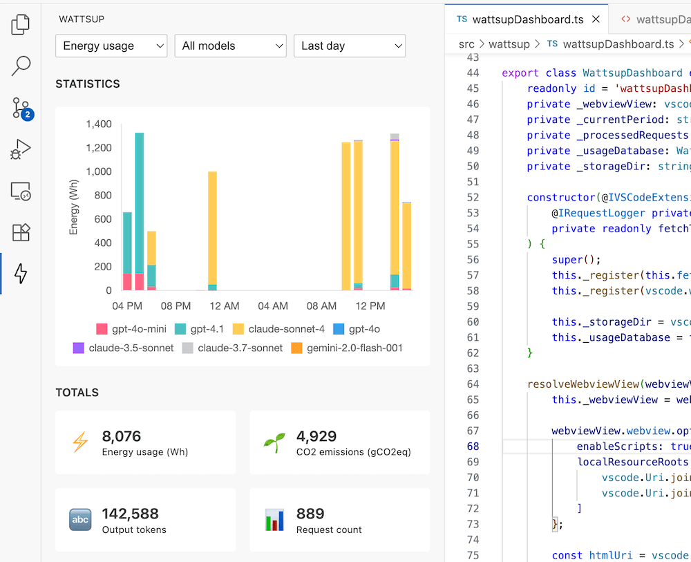

# Wattsup with Github Copilot

*This is a fork of [vscode-copilot-chat](https://github.com/microsoft/vscode-copilot-chat), the official VS Code extension for Github Copilot Chat.*

Wattsup with Github Copilot allows you to monitor AI requests usage with the integrated Wattsup dashboard, giving quick access to key metrics such as output token usage and CO2 emission equivalences over different time periods.



## Installation

### From VS Code

Since this extension cannot be released in the VS Code marketplace, you will need to download the [latest release](https://github.com/Ucodia/wattsup-vscode-copilot-chat/releases) and install it manually by using the "Install from VSIX" command in VS Code.

### From command line

```
wget https://github.com/Ucodia/wattsup-vscode-copilot-chat/releases/download/v99.2.0/wattsup-copilot-chat-99.2.0.vsix
code --install-extension wattsup-copilot-chat-99.2.0.vsix
```

## Development

### Code organization

Since this is a fork of the official VS Code extension, the changes to common files has been limited and most of the logic lives in [src/wattsup](src/wattsup) in order to continue syncing this fork with the source.

### Core logic

The core logic is bootstraped by the [WattsupDashboard](src/wattsup/wattsupUsageDatabase.ts) web view. The extension periodically checks the [RequestLogger](src/platform/requestLogger/node/requestLogger.ts) requests list to collect AI request information. This data is then mapped to the closest model currently available in [EcoLogits](https://ecologits.ai/) calculator to estimate the energy consumption and environmental impacts of AI requests.

### Data storage and analytics

Data storage is defined in the [WattsupUsageDatabase](src/wattsup/wattsupUsageDatabase.ts) class. Current implementation relies on a singular `usage.csv` file stored in the extension storage folder. The file is locked before writes and only appended to guarantee consistency across VS Code instances. [arquero](https://github.com/uwdata/arquero) memory tables are used to compute analytics. This may not scale over time and require using a more robust data source engine such as [SQLite](https://github.com/sqlite/sqlite-wasm).

### Packaging and quirks

The official `vscode-copilot-chat` extension from which this repository is forked, relies on another non open source `vscode-copilot` extension. This makes it impossible to have both the Wattsup version of the extension and the official extension together. As such this fork was versioned differently starting with version `99.x.x` to avoid conflict with the official release.

Microsoft team confirmed that they are actively working on open sourcing the remaining bits from closed source component (see [GitHub issue](https://github.com/microsoft/vscode/issues/258742)).

If you want to build this from source, make sure to switch the [package.json](package.json#L10) `buildType` is set to `prod` before running `npm run package`.

### Synchronizing upstream releases

In order to properly sync commits from an upstream release, we first need to fetch the tags and then merge the commit at the tip of the tag reference such as:

```
git fetch upstream refs/tags/v0.30.1
git merge --no-ff v0.30.1^{}
```